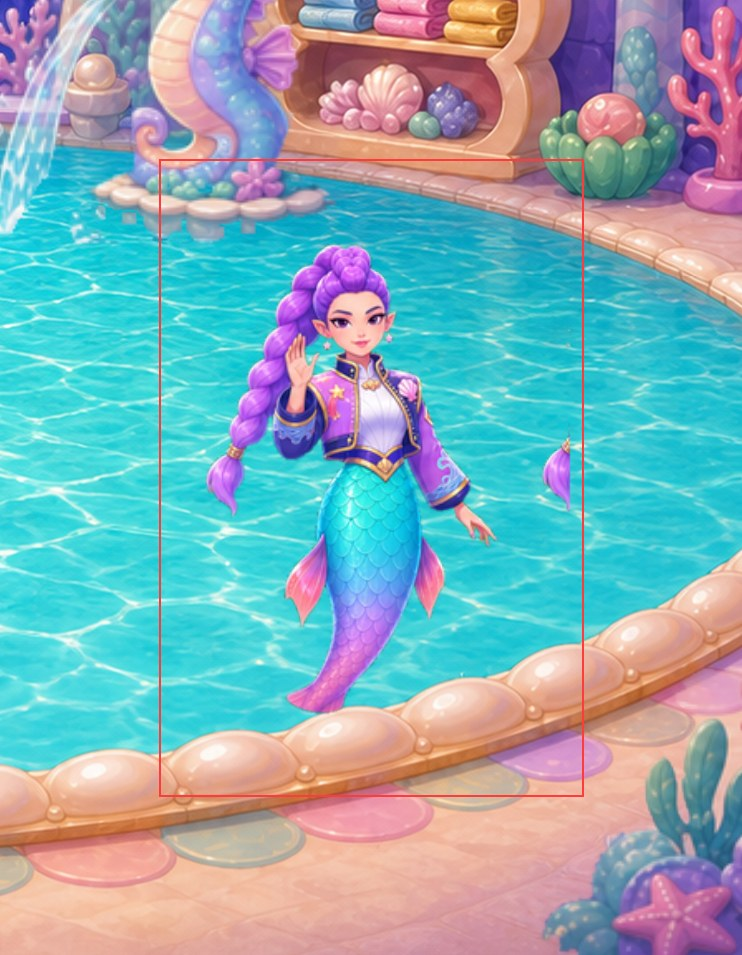
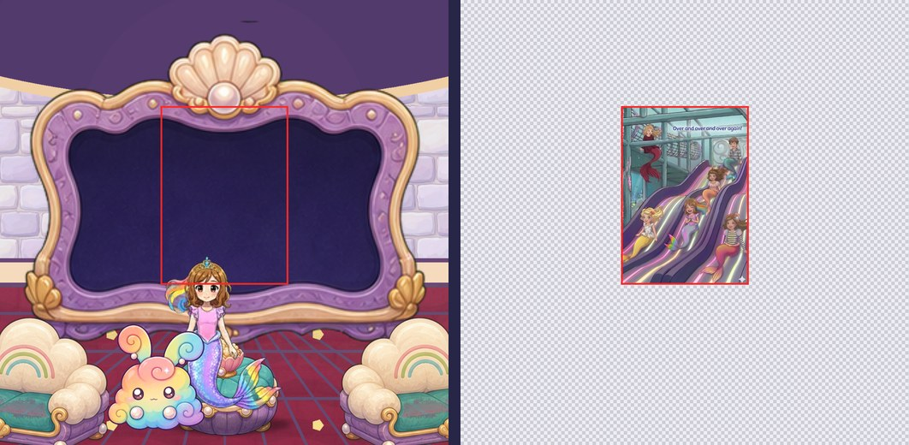
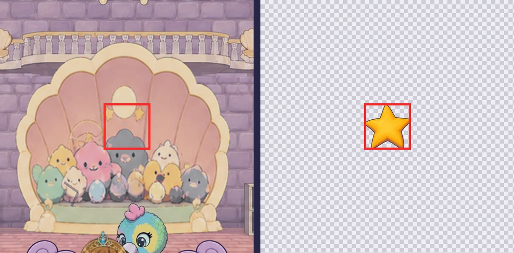
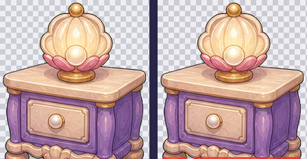
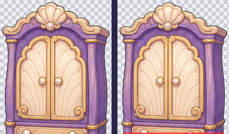
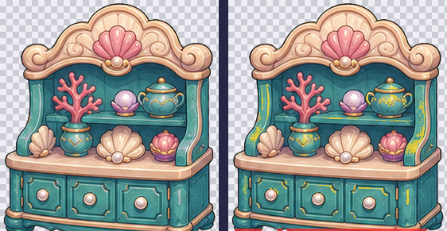
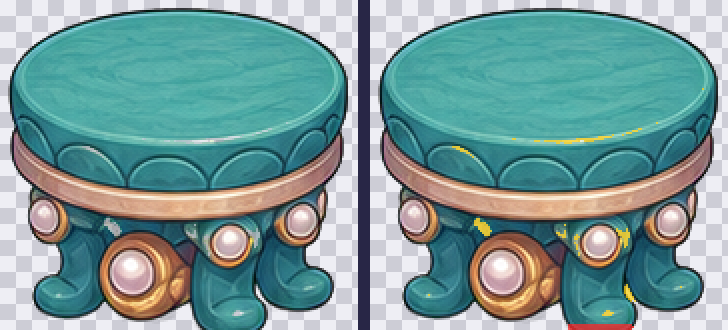
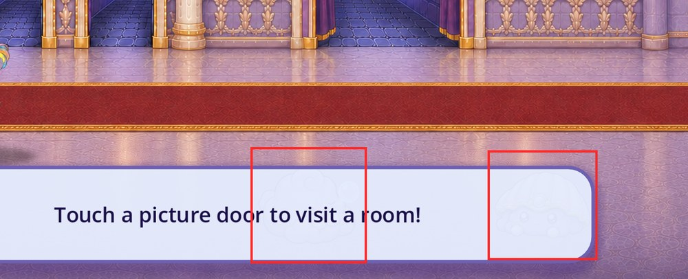
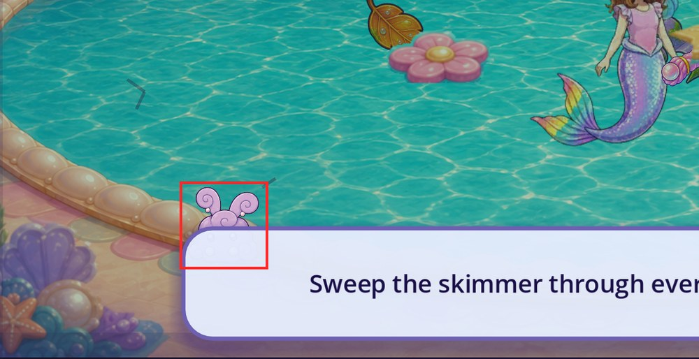

# Castle sprite transparency and cut-off audit (2026-09-25)

**Status:** evidence and recommendations only. Prepared by Claude, which made no
game changes; Codex implements. Nothing here grants visual, device, child or
owner acceptance.

**Baseline:** `dev` at `f76a8ba5`, exact Godot 4.7.2, Windows desktop display
build at 1280×720 logical (captured at 2560×1369), isolated test saves.

**Revision 2 (2026-09-25)** adds:
- a visibility pass, which found two hidden objects (T15, T16) and an interface
  overlap (O1);
- a [cut-off analysis](#cut-off-analysis) of every image that touches its edge;
- the five evidence images the first revision left out.

## What was checked

1. **Every object drawn in the castle.** A capture script
   ([`tools/inventory.gd`](tools/inventory.gd)) booted the real game, visited all
   13 castle rooms in free play plus the four Day One dirty rooms, and recorded
   every visible `Sprite2D`, `AnimatedSprite2D`, `TextureRect`, `TextureButton`
   and `NinePatchRect`, with the exact texture region each one draws: 345 draws,
   217 unique images ([`data/inventory_*.json`](data/)).
2. **Measured each drawn image** ([`tools/analyze.py`](tools/analyze.py)):
   - art touching the card edge (cut off);
   - detached pieces near the edge (bled in from a neighbouring frame);
   - partly transparent areas inside a solid silhouette (see-through);
   - light halos or black matte rims;
   - baked checkerboards;
   - cards with no transparency at all.
3. **Swept every cell of 53 sprite sheets**, not just the frame on screen at
   capture time ([`tools/sweep_sheets.py`](tools/sweep_sheets.py)). This found
   bleed in frames that only appear mid-animation.
4. **Checked that every object can actually be seen**
   ([`tools/occlusion.py`](tools/occlusion.py)). It compared each object's
   opaque pixels with the screenshot taken in the same frame:
   - 301 objects at 90% opacity or more with at least 400 opaque pixels;
   - results in [`data/occlusion.json`](data/occlusion.json);
   - the 40 objects scoring under 60% visible were reviewed by eye;
   - [`tools/occlusion_evidence.py`](tools/occlusion_evidence.py) drew the
     evidence images.
5. **Reviewed every flag by eye.** Intended effects were set aside, for example
   dust puffs, a brush lifted mid-dip, ghost-hand halos, shadows, a net and
   outlines (see [Reviewed and not errors](#reviewed-and-not-errors)).

The Grand Puff arena could not be captured in this pass; its sheets were covered
by the cell sweep instead.

**Numbering:** frames count from 0, left to right along the top row, then the
next row. Cells are written as (column, row).

## Findings

Severity:
- **P1:** visible in normal play at phone size;
- **P2:** visible when looking or during an animation;
- **P3:** minor, or only in art slated for repainting.

| ID | Sev | Asset | Where it shows | Error |
|---|---|---|---|---|
| T1 | P1 | `assets/characters/rumi/rumi_eight_pose_runtime.png` | Mermaid Pool hide-and-seek (`ComfyHidden_rumi`), Day One wave | Neighbouring frames' braid and fins bleed into 4 of 8 cells |
| T2 | P1 | `assets/book/baby_eagle.png` | Playroom hide-and-seek, castle companion card, rescue scene | Book crop cut off at the left edge, with backpack and doll |
| T15 | P1 | `assets/flats/castle/dream_house/movie_screen_frame.png` | Movie Lounge screen | Screen painted opaque; hides the family home-movie picture behind it |
| T16 | P1 | Rescue guide star (`assets/mg/star.png`) in `scripts/arena/castle_rooms_25d.gd` | Day One playroom rescue | The pointer over Baby Eagle draws behind the stuffie nook |
| T3 | P2 | `assets/flats/castle/dream_house/cloud_settee.png` | Movie Lounge | Seat cushions partly transparent; the red floor shows through |
| T4 | P2 | `assets/flats/castle/dream_house/dream_bed_1.png` | Sleepover Bedroom | Quilt partly transparent (17% of the silhouette) |
| T5 | P2 | `assets/flats/castle/interactions_v2/playroom_blocks_sheet.png` | Playroom blocks, when tapped | Tossed blocks sliced by cell edges in frames 3–5 |
| T6 | P2 | `assets/flats/castle/interactions_v2/opera_hall_footlights_sheet.png` | Opera Hall footlights, when tapped | Pieces of the neighbouring frame's bar at cell edges in 4 frames |
| T7 | P3 | `assets/flats/castle/interactions_v2/library_book_stack_sheet.png` | Library book stack, when tapped | Thin slivers at the left edge of 4 frames |
| T8 | P3 | `assets/flats/castle/interactions_v2/craft_room_idea_board_sheet.png` | Craft Room idea board, when tapped | Slivers at the left edge of 2 frames |
| T9 | P3 | `assets/flats/castle/interactions_v2/opera_hall_curtains_sheet.png` | Opera Hall curtains, when tapped | Sliver at the right edge of 1 frame |
| T10 | P3 | `assets/castle/day_one_pool/activities/floating_trash_atlas.png` | Day One pool trash | Candy-wrapper corner cut at its cell edge; one stray fragment |
| T11 | P3 | `assets/flats/castle/dream_house/` furniture (4 files) | Dining Room, Royal Bedroom | Bases cut flat by the card's bottom edge |
| T12 | P3 | `assets/characters/roshan_25d/` swim and gesture sheets | Roshan everywhere | 1,302 px of neighbouring-figure pixels inside the shipped sampling windows |
| T13 | P3 | `assets/sprites/dust_bunnies/boss/dust_bunny_boss_jump.png` | Grand Puff jump | Dust ring touches the left edge of frame 3 |
| T14 | check | `assets/castle/dirty_cleanup_2d/critters/dust_bunnies/dust_bunny_hop.png` | Day One playroom (bunnies pinning Baby Eagle) | Detached swoosh behind the bunny; confirm it is intended |

Interface overlap (not a sprite error):

| ID | Sev | Where | Problem |
|---|---|---|---|
| O1 | P2 | Main Hall, Day One pool and bath | The instruction panel covers dust bunnies and part of a cleanup basket while it is up |

## Cut-off analysis

Every image found touching the edge of its card or cell, and what that means. Room
backgrounds and foreground framing cards meet the stage edge by design and are
excluded.

**Drawn images:** 7 of the 217 touch their card edge; 6 of those are errors.

| Image | Room | Edge touched | Verdict |
|---|---|---|---|
| `assets/book/baby_eagle.png` | Playroom | Left, 285 of 512 px; top 10 and bottom 12 of 290 px | Error: T2 |
| `dream_house/shell_wardrobe.png` | Royal Bedroom | Bottom, 205 of 227 px | Error: T11 |
| `dream_house/provisions_hutch.png` | Dining Room | Bottom, 175 of 275 px | Error: T11 |
| `dream_house/bedside_table.png` | Royal Bedroom | Bottom, 155 of 218 px | Error: T11 |
| `dream_house/dining_seat.png` | Dining Room | Bottom, 32 of 179 px | Error: T11 |
| `dream_house/cloud_settee.png` | Movie Lounge | Right, 26 of 238 px | Minor error, noted with T3 |
| `assets/book/hall/p_slide.jpg` | Movie Lounge | All four edges | By design: a rectangular picture (but hidden, T15) |

**Sprite sheets:** 16 of the 53 sheets (437 cells) have flagged cells; 8 contain
errors.

| Sheet | What the sweep found | Verdict |
|---|---|---|
| `rumi_eight_pose_runtime.png` | 4 cells carry neighbouring poses' braid and fins; her own poses are complete | Error: T1 |
| `playroom_blocks_sheet.png` | Tossed blocks sliced across cell lines in frames 3–5 | Error: T5 |
| `opera_hall_footlights_sheet.png` | Pieces of the neighbouring bar in frames 1, 2, 5 and 6 | Error: T6 |
| `library_book_stack_sheet.png` | Slivers in frames 1, 2, 5 and 6 | Error: T7 |
| `craft_room_idea_board_sheet.png` | Slivers in frames 1 and 5; the detached paint-jar row is intended | Error: T8 |
| `opera_hall_curtains_sheet.png` | Sliver in frame 6 | Error: T9 |
| `floating_trash_atlas.png` | Wrapper cut at the right edge of cell (0, 0); a stray fragment in (1, 0) | Error: T10 |
| `dust_bunny_boss_jump.png` | Dust ring touches frame 3's left edge; the other marks are intended puffs | Error: T13 |
| `waterfall_clogged_original_match.png` | Three strips touch their neighbours | By design: they butt together |
| `library_magic_book_sheet.png`, `playroom_stacking_toy_sheet.png`, `craft_room_paint_table_sheet.png` | Detached book, rings and brush | By design: animation poses |
| `dust_bunny_boss_angry.png`, `dust_bunny_boss_flinch.png`, `dust_bunny_boss_implode.png`, `dust_bunny_boss_laugh_vulnerable.png` | Detached puffs, motion lines and sparkles | By design: effects |

**Roshan:** her sheets are not cut off. `tools/audit_roshan_sprite_clipping.py`
reports 0 px of her art lost in the shipped sampling windows; the problem is
ghost pixels (T12).

## Evidence and fixes

### T1 — Rumi: neighbouring frames bleed into her cells (P1)

In the pool, a piece of purple braid floats to Rumi's right. Her pose sheet is 4×2
cells of 256×384 px, and the braid and fins of neighbouring poses cross the cell
lines. Foreign pixels sit near the edges of four cells:
- (2, 0): 479 px, the braid tip from column 3. This cell is the one used by the
  pool hide-and-seek card and the wave.
- (0, 1), (1, 1) and (2, 1): 111, 870 and 367 px of neighbouring fins.

**Fix for Codex:**
- Re-pack the sheet from the approved identity package
  (`assets_src/characters/rumi_2026-08-22/rumi_eight_pose_atlas.png`) with at least
  8 px of clear gutter around every pose, or clear each cell of pixels that belong
  to another pose.
- This moves existing pixels only. Rumi is on IP hold and must not be regenerated.
- Keep the runtime contract in `assets_src/characters/rumi_2026-08-22/PROVENANCE.json`
  in step, and add the cell sweep as a gate.

### T2 — Baby Eagle: the book crop is cut off (P1)

`assets/book/baby_eagle.png` is the whole book crop. The eagle leans over an open
pink backpack with a doll inside, and the art runs into the left edge: one
unbroken stretch of 285 px along the 512 px left edge is solid art. It shows as the
playroom hide-and-seek card, the castle companion card beside Roshan, and in the
rescue scene.

**Fix:** use the backpack-free cutout the owner approved on 2026-09-24 (see
[README](README.md#owner-approved-work-queue)). The book file itself is protected
and stays unchanged.

### T15 — Movie Lounge: the screen hides the family home movie (P1)

The lounge's screen is meant to show the family's book pictures (`MOVIE_IMAGES`:
`p_slide`, `p_trampoline`, `p_garden`, `p_snowman` and `p_xmas` from
`assets/book/hall/`). Tapping it crossfades to the next one. But:
- `movie_screen_frame.png` has an opaque dark screen (alpha 255 across its
  middle);
- the frame draws above the picture (z 76 against 48);
- the picture sits entirely inside the frame.

So the child sees a blank dark screen. Tapping it plays the sound and says
"Movie night! ...", then crossfades a picture nobody can see. This breaks
`DL-READ-02` (every interactive object stays identifiable) and the intentional
card ordering of `DL-LAY-01`.

`scripts/probe_interaction.gd` passes: it checks the picture's texture, index
and metadata, but not whether the picture can be seen.

**Fix for Codex:**
- Either make the frame's screen area transparent (an alpha edit of the existing
  art, no redraw), or draw the picture above the frame and fit it inside the
  opening.
- Leave the book pictures unmodified.
- Add a probe check that the picture is visible, for example that no opaque card
  above it covers its centre.

### T16 — Day One playroom: the rescue guide star is hidden (P1)

While two dust bunnies pin Baby Eagle, a pulsing star is meant to point at the
rescue (`_add_playroom_rescue_pointer` in `scripts/arena/castle_rooms_25d.gd`).
- The star never sets its z-index, so it draws at 0.
- The stuffie nook card (z 75) is opaque where the star sits, and covers it.
- The tap sparkles in the same effects layer set their z from `EFFECT_Z` (4.35,
  drawn at 435) and show correctly.

Every objective needs a voice line and a visual pointer, and a pointer must point
at the live object (`DL-READ-06`). This objective's pointer cannot be seen.

The star is also created after the rescue is finished: the free-play capture has
it, hidden in the same place. Raising it alone would leave a stale star in free
play, which `DL-READ-06` also forbids.

**Fix for Codex:**
- Set the star's z-index from `EFFECT_Z`, as the tap sparkles do.
- Create it only while `_playroom_rescue_done()` is false; it is already freed
  when the rescue completes.
- Add probe coverage for both.

### T3 — Cloud settee: see-through cushions (P2)

The teal seat cushions are drawn at about 69% opacity (mean alpha 175), so the red
lounge floor tints them. The art also touches the card's right edge.

### T4 — Dream bed: see-through quilt (P2)

17% of the bed's silhouette is partly transparent (mean alpha 174), mostly the
quilt.

**Fix for T3 and T4:** make the cushion and quilt pixels fully opaque. Both
belong to the flat-style rooms that the aesthetics plan recommends repainting, so
fix them there if the repaint comes first.

### T5–T10 — Interaction sheets: slivers and sliced pieces (P2–P3)

The tap animations use 4×2 sheets whose moving parts cross the cell lines, so
pieces are cut or show up in the next frame. In the marked sheets below:
- blue lines are cell borders;
- magenta marks detached pixels near a cell edge;
- red marks art cut by an edge.

Some magenta marks are intended (see the notes under each image).

T5: frames 3–5 slice tossed blocks at the cell edges. Frame 6's block in the air
is intended.

T6: frames 1, 2, 5 and 6 carry pieces of the next frame's footlight bar.

T7: slivers at the left edge of frames 1, 2, 5 and 6.

T8: slivers at the left edge of frames 1 and 5. The detached row of paint jars is
part of the design.

T9: a sliver at the right edge of frame 6.

T10: the candy wrapper touches its cell's right edge.

**Fix for Codex:** re-pack each sheet with clear gutters from its source frames
(the v2 sheets come from `tools/normalize_castle_interaction_v2_sheets.py`; the
pool trash atlas from its own source pack), then rerun the castle interaction
audits. No redrawing is needed.

### T11 — Flat-room furniture cut flat at the base (P3)

The feet of four pieces meet the card's bottom edge as a straight cut. Each pair
below shows the card in the room, then the art as drawn (left) and marked
(right). Red marks art cut by the edge. The small yellow marks are scattered
partly transparent pixels, below the see-through threshold.

These rooms are the ones recommended for repainting; fold the fix into that work.

### T12 — Roshan: ghost pixels from neighbouring figures (P3)

`tools/audit_roshan_sprite_clipping.py` reports that the shipped sampling windows
lose none of Roshan's art (0 px clipped) but still include 1,302 px of
neighbouring figures, down from 37,531 px on a naive grid. Clearing them needs a
re-pack like T1; keep the anchor tables (`scripts/roshan_sprite_anchors.gd`,
`scripts/roshan_sprite_frames.gd`) in step.

### T13 — Grand Puff jump frame 3 (P3)

The dust ring under frame 3 touches the cell's left edge. The other magenta marks
are Grand Puff's intended dust puffs.

### T14 — Dust bunny swoosh (check)

A separate swoosh shape sits behind the bunny. It reads as a motion mark, but
confirm it is intended.

### O1 — Instruction panels cover objects in the room (P2, interface)

The instruction panel sits over the bottom of the stage. In the captures it
covers:
- both Main Hall dust bunnies, under "Touch a picture door to visit a room!";
- the lower half of a Day One pool dust bunny, under "Sweep the skimmer...";
- the bottom of the Day One bath's cleanup basket.

`DL-READ-02` requires every interactive object to stay identifiable with the HUD
present. This is also the interface-harmony point in
[AESTHETICS_PLAN.md](AESTHETICS_PLAN.md): smaller panels, kept away from the
action. Codex should also check how long each panel stays up.

## Reviewed and not errors

- **Touch-halo gradients and Roshan's contact shadow:** translucent by design.
- **Pool skimmer net:** see-through by design.
- **Grime bubbles around sink and tub targets:** separate bubbles by design.
- **Daddy (library hide-and-seek), Roshan's frames, the chandelier ring and the
  ribbon rack:** the flagged "holes" are real gaps between body parts, correctly
  transparent.
- **Magic book floating over its shell, stacking-toy rings, paint-table brush:**
  intended animation poses.
- **Grand Puff's flinch, angry, laugh and implode puffs, motion lines and
  sparkles:** intended effects.
- **Dark rims on pans, tent, footlights and crests:** the art style's deep-indigo
  outline (`DL-VIS-02`).
- **Clogged waterfall lanes:** three strips meant to butt together.
- **Career portrait cards and crests:** small partial-alpha areas that do not
  read as errors on the card.
- **Foreground framing cards:** meet the stage edge by design.
- **Low visibility scores, 33 of the 40 reviewed.** The other 7 are T15, T16
  and O1.
  - Day One's dimmed dirty-room look darkens every object in those rooms.
  - Characters stand in front of props:
    - Roshan at the popcorn bowl, stage star, cloud pouf, dream bed and Baby
      Eagle;
    - Daddy in the library chair;
    - the dust bunnies pinning Baby Eagle.
  - The return button and props sit over background tiles.
  - One Main Hall tile lies almost entirely past the screen edge, under the
    letterbox bar.
  - The bedside table shows its switched-off lamp tint.
  - The Dining Room chandelier hangs mostly behind the arch's picture card. It is
    decorative only.
  - Baby Eagle's hide-and-seek button draws its picture aspect-fit, which the
    comparison does not model. The card is visible; its art problem is T2.

## Recommended guards

Codex should turn two of these scripts into CI gates.

- **Sheet cells:** [`tools/sweep_sheets.py`](tools/sweep_sheets.py), for example as
  `tools/audit_castle_sprite_alpha.py`. It would:
  - check every runtime sprite sheet's cells for foreign pixels near the edges
    and for art cut by an edge;
  - allow a reviewed list of intended detached effects;
  - fail when any new bleed appears.
- **Visibility:** a probe that every objective pointer and every protected
  picture has no opaque card drawn above its centre. It can check z-order and
  alpha directly, or compare rendered pixels as
  [`tools/occlusion.py`](tools/occlusion.py) does.

Why the existing checks missed these:
- The castle alpha audits check room cards and backgrounds, but not character
  sheets or interaction frames (T1–T13).
- The interaction probes check textures and metadata, not whether an object can
  be seen (T15, T16).

## Limits

- **Desktop, not phone.** Captures come from the Windows desktop display build.
  VRAM compression on the phone may add alpha noise that this pass does not see.
- **Not captured live.** The Grand Puff arena and Day One's middle states (for
  example Rumi rising) were covered by the cell sweep only.
- **One moment per room.** The visibility pass:
  - measures one moment per captured room;
  - records opacity but not colour tints;
  - ignores rotation and aspect-fit button stretching.

  So it can miss an object hidden only in states that were not captured.
- **Candidates, not verdicts.** Heuristic thresholds found candidates; every
  listed finding was confirmed by looking at the marked evidence.
